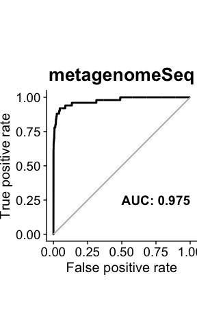
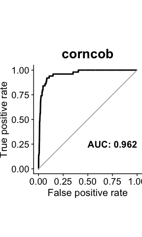

# Microbiom Gym

A Short Introduction to the Microbiom Gym


<div style="margin-bottom:50px;">

</div>

## Introduction

The Microbiome Gym contains tools for analyzing the microbiome count
data:

  - Providing simulated and sythetic data with documented assumptions
  - Implementing a wide range of statistical models for the differential
    abundance analysis
  - Visuliazing the model performance of selecting the discriminating
    features

<div style="margin-bottom:50px;">

</div>

## Contents

  - [Dependency](#dependency)
  - [Statistical tests](#tests)
  - [Main functions](#functions)
      - [Model input](#inputs)
      - [Model output](#outputs)
  - [Data for model evaluation](#datasets)
  - [An example of Microbiome Gym](#examples)
      - [Load data](#loaddata)
      - [Apply statistical tests](#fit-model)
      - [Vizualize model performance](#vizualize-model-performance)
  - [Contact](#contact)

## Dependency

R (version 3.6.0 or later)

**R Packages**

  - Rcpp (version 1.0.2 or later)
  - BiocManager (version 1.30.8 or later)
  - DESeq2 (version 1.24.0 or later)
  - edgeR (version 3.26.8 or later)
  - SummarizedExperiment (version 1.14.1 or later)
  - zinbwave (version 1.6.0 or later)
  - metagenomeSeq (version 1.26.3 or later)
  - DAtest (version 2.7.14)
  - stringr (verision 1.4.0 or later)
  - LDM (version 1.0)
  - corncob (version 0.1.0)
  - plyr (version 1.8.4 or later)
  - pROC (version 1.15.3 or later)
  - ggplot2 (version 3.2.1 or later)
  - cowplot (version 1.0.0 or later)

<div style="margin-bottom:50px;">

</div>

## Statistical tests

Microbiome Gym provides the following statistical tests for the
differential abundance analysis of microbiome count data.

  - [t-test and ANOVA](#anova)
  - [Wilcoxon rank-sum test and Kruskal-Wallis test](#kruskal)
  - [DESeq2](#deseq2)
  - [edgeR](#edger)
  - [WaVE-DESeq2 and WaVE-edgeR](#wave)
  - [metagenomeSeq](#metagenomeseq)
  - [DA test](#DAtest)
  - [corncob](#corncob)
  - [LDM](#ldm)
  - [ZINB-DPP](#zinbdpp)
    <div style="margin-bottom:50px;">
    </div>

Below, we give a brief introduction of all the statistical testings
provided by Microbiome Gym.

<div style="margin-bottom:25px;">

</div>

#### t-test and ANOVA

###### – named as `tTest`, `ANOVA` in Microbiome Gym

Many classic statistical tests are available to analyze gut microbiome.
We can use the t-test to compare the mean of each individual taxon’s
relative abundance between two phenotype groups. Or we can use one-way
analysis of variance (ANOVA) when having more than two groups.

<div style="margin-bottom:25px;">

</div>

#### Wilcoxon rank-sum test and Kruskal-Wallis test

###### – named as `WilcoxonRankSum`, `KruskalWallis` in Microbiome Gym

Wilcoxon rank-sum test and Kruskal-Wallis test are the non-parametric
analogous of the t-test and ANOVA, respectively.These two non-parametric
tests are widely used for comparing the median of each individual
taxon’s relative abundance across phenotype groups.

<div style="margin-bottom:25px;">

</div>

#### DESeq2

###### – named as `DESeq2` in Microbiome Gym

DESeq2 is a method for differential analysis of count data using
shrinkage estimation for dispersions and fold changes to improve
stability and interpretability of estimates (Love, Huber, and Anders
2014). DESeq2 is widely used for analyzing the RNA-Seq data, and is
further adopted for studying microbiome data.

More details can be found
[here](https://www.ncbi.nlm.nih.gov/pmc/articles/PMC4302049/).

<div style="margin-bottom:25px;">

</div>

#### edgeR

###### – named as `edgeR` in Microbiome Gym

edgeR is designed for gene expression studies to determine whether there
is evidence that counts for a transcript or exon are significantly
different across experimental conditions (Robinson, McCarthy, and Smyth
2010). Empirical Bayes methods are used to moderate the degree of
overdispersion across transcripts, improving the reliability of
inference. Through developed specifically for RNA-Seq data like DESeq2,
edgeR has also been used on microbiome data.

More details can be found
[here](https://www.ncbi.nlm.nih.gov/pmc/articles/PMC2796818/).

<div style="margin-bottom:25px;">

</div>

#### WaVE-DESeq2 and WaVE-edgeR

###### – named as `WaVEDESeq2`, `WaVEedgeR` in Microbiome Gym

Unlike the RNA-Seq data, the microbiome sequencing and single-cell
sequencing data usually contain a large amount of zeros. To further
account for the excessive zeros, Risso et al. (2018) presented a general
and flexible model for the analysis of high-dimensional zero-inflated
count data, called <u>z</u>ero-<u>i</u>nflated <u>n</u>egative
<u>b</u>inomial-based <u>wa</u>nted <u>v</u>ariation <u>e</u>xtraction
(ZINB-WaVE). The R package `zinbwave` published by Risso et al. (2018)
can calculate the observational weights for the zeros. They authors
proposed to downweight zeros using the new weights in order to
accomodate DESeq2 and edgeR for the differential abundance analysis. We
refer to the new tests as WaVE-DESeq2 and WaVE-edgeR.

More details can be found
[here](https://www.nature.com/articles/s41467-017-02554-5).

<div style="margin-bottom:25px;">

</div>

#### metagenomeSeq

###### – named as `metagenomeSeq` in Microbiome Gym

metagenomeSeq is designed to determine taxonomic features
(e.g. Operational Taxanomic Unit (OTU), species, etc.) that are
differentially abundant between two or more groups of multiple samples
(Paulson et al. 2013). metagenomeSeq includes a novel normalization
technique and a zero-inflated Gaussian model that accounts for
undersampling.

More details can be found
[here](https://www.nature.com/articles/nmeth.2658).

<div style="margin-bottom:25px;">

</div>

#### DA test

###### – named as `DATest` in Microbiome Gym

DA test compares different statistical methods for differential
abundance and expression analysis on datasets such as RNA-Seq,
proteomics, metabolomics and microbiome data. The R package `DAtest`
provides 25 statistical methods and their variations. Different methods
are compared based on manipulating the original data. The process
includes

1)  Shuffling the phenotype labels (e.g. case and control)
2)  Spiking in data to associate part of the randomly chosen features
    with the shuffled phenotype labels
3)  Applying the relavent methods and calculating the false positive
    rate and AUC for each method
4)  Repeating the above steps to obtain averaged results for each method

One can select the final method to be the one with best performance to
analyze the original data.

More details can be found
[here](https://www.biorxiv.org/content/10.1101/241802v1).

<div style="margin-bottom:25px;">

</div>

#### corncob

###### – named as `corncob` in Microbiome Gym

corncob is short for <u>c</u>ount <u>r</u>egressio<u>n</u> for
<u>c</u>orrelated <u>o</u>bservations with the <u>b</u>eta-binomial
(Martin, Witten, and Willis 2019). corncob implements a beta-binomial
regressin model to associate a taxon’s relative abundance with
covariates of interest, such as phenotype. It uses likelihood ratio test
(LRT) to provide inference on the regression coefficients. Taxa showing
differential abundance under different phenotypes are selected based on
p-values from LRT.

More details can be found [here](https://arxiv.org/abs/1902.02776).

<div style="margin-bottom:25px;">

</div>

#### LDM

###### – named as `LDMtest` in Microbiome Gym

LDM stands for the <u>l</u>inear <u>d</u>ecomposition <u>m</u>odel
proposed by Hu and Satten (2017). LDM is designed for analyzing
microbiome count data such as that obtained in a 16S rRNA study or a
metagenomics sequencing study. LDM provides global tests of any effect
of the microbiome, as well as tests of the effects of individual
taxonomic features with a connection to distance-based ordination. LDM
uses permutation-based p-values to select discriminating taxonomic
features across phenotypes.

More details can be found
[here](https://www.biorxiv.org/content/10.1101/229831v2).

<div style="margin-bottom:25px;">

</div>

#### ZINB-DPP

###### – named as `ZINBDPP` in Microbiome Gym

The ZINB-DPP model is a special case of the bi-level Bayesian framework
for microbiome data differential abundance analysis proposed by Li et
al. (2019). ZINB-DPP refers to <u>z</u>ero-<u>i</u>nflated
<u>n</u>egative <u>b</u>inomial model with the <u>D</u>irichlet
<u>p</u>rocess <u>p</u>rior for sample normalization. The ZINB-DPP model
selects the discriminating taxa by joinly model taxa from different
taxonomic levels while offering well-controlled Bayesian false discovery
rates.

More details can be found [here](https://arxiv.org/abs/1902.08741).

<div style="margin-bottom:50px;">

</div>

## Main functions

We load the main functions of Microbiome Gym by running the following
code:

``` r
source("MicrobiomeGym.R")
```

The three functions below implement the statistical tests and evaluate
the model performance.

  - `MicrobiomeGym`: Function to implement different statistical test
    for differential abundance analysis
  - `gymControl`: Control the computational auances of the
    `MicrobiomeGym` function
  - `plot.ROC`: Vizualize the model performance with respect to
    selecting the truly discriminating features

### Model input

`MicrobiomeGym` is the main function, which takes three input:

  - `count.matrix`: The \(n\)-by-\(p\) microbiome count matrix obtained
    in a 16S rRNA study or a metagenomics sequencing study, where \(n\)
    is the sample size and \(p\) is the number of taxonomic features
  - `phenotype`: A vector of length \(n\) with distinct levels
    representing multiple phenotypes
  - `gymControl`: A function that passes additional information of the
    statistical model to be implemented, and the corresponding
    model-specific parameters. For example, we can specify to use ANOVA
    for some given `count.matrix` and `phenotype` as

<!-- end list -->

``` r
# For ANOVA, we only need to specify the method name
anova.control = gymControl(method = "ANOVA")
# run Microbiome Gym with ANOVA
MicrobiomeGym(count.matrix = count.matrix, 
              phenotype = phenotype, 
              gymControl = anova.control)
```

Notice that the samples (row) in `count.matrix` should match with their
phenotype information in `phenotype`.

In Microbiome Gym, it is sufficient to specify **only the method name**
for the following methods:

  - `tTest`, `ANOVA`, `WilcoxonRankSum`, `KruskalWallis`, `DESeq2`,
    `edgeR`, `WaVEDESeq2`, `WaVEedgeR`, `metagenomeSeq`, `LDMtest`

For the rest tests, users can personalize the model specific parameters
described below:

  - `DATest`:
      - `core.num`: Number of cores to use for parallel computing
      - `R`: Number of replicated times to run the tests
      - `seed`: Random seed set for iterations
  - `corncob`:
      - `count.min`: The minimum number of nonezero counts required for
        a taxon to implement `corncob`
  - `ZINBDPP`:
      - `N.mcmc`: Number of MCMC iterations
      - `b`: Shape hyper-parameter for the variance term (for more
        details, see [the original
        paper](https://arxiv.org/abs/1902.08741))
      - `h`: Scale hyper-parameter for the variance term (for more
        details, see [the original
        paper](https://arxiv.org/abs/1902.08741))
      - `count.min`: Minimum number of nonzero counts required for a
        taxon to fit the ZINB-DPP model
      - `seed`: Random seed set for MCMC

Taking `ZINBDPP` as an example,

``` r
# Specify the model-specific parameters for ZINB-DPP model
ZINBDPP.control = gymControl(method = "ZINBDPP", N.mcmc = 10000, b = 1, h = 10, count.min = 2, seed = 1)
# run Microbiome Gym with ZINB-DPP
MicrobiomeGym(count.matrix = count.matrix, 
              phenotype = phenotype, 
              gymControl = anova.control)
```

The function `gymControl` includes the defualt parameter values for all
the methods. Hence, it is enough to just specify the method name. For
example,

``` r
MicrobiomeGym(count.matrix = count.matrix, 
              phenotype = phenotype, 
              gymControl = gymControl(method = "corncob"))
```

<div style="margin-bottom:50px;">

</div>

### Model output

The output of Microbiome Gym depends on the test. In general, the output
contains

  - P-values (or posterior probabilities from ZINB-DPP as an analogy)
  - Model-specific details
  - Name of the method implemented
  - Original input `count.matrix`
  - Original input `phenotype`

For the model-specific details, user can refer to the original
manuscripts or the package tutorials for more details. Here, we take
`ZINBDPP` as an example.

The output of `ZINBDPP` includes:

  - `remove.idx` A binary vector of length \(p\) showing if a taxon is
    dropped from fitting the ZINB-DPP model (the corresponding element
    euquals \(1\) if dropped)
  - `gamma.ppi`: The posterior probability of inclusion (PPI) for the
    taxa not removed. PPI is analogous to the p-value. The larger the
    PPI, the higher the probability of a taxon to be discriminating
    across the phenotypes
  - `fold.change` Fold change of the normalized abundance for for the
    taxa not removed
  - We omit other model-specific output here since they are not
    necessary for model evaluation.

<div style="margin-bottom:50px;">

</div>

## Data for model evaluation

We provide simulated and sythetic data for model evaluations. For both
types of data, we set \(p = 1000\) taxonomic features, where \(50\) of
them are truely discriminating between phenotype groups. We considered
different sample sizes, log-scale effect sizes of the discriminating
taxa, number of phenotype groups, and data generating mechanisms. Under
each setting, we generated \(50\) replicates for model evaluation. More
detials are available in the Supplementary materials [of this
paper](https://arxiv.org/abs/1902.08741).

<div style="margin-bottom:25px;">

</div>

#### Simulated data

We varied sample sizes (\(n \in \{24, 108\}\)), log-scale effect sizes
(\(\sigma \in \{1, 2\}\)), number of phenotype groups
(\(K \in \{2, 3\}\)), and data generating mechanisms (from a ZINB model
or Dirichlet multinomial model) to generate simulated data under
different scenarios. We can load the data as follows:

``` r
# load the data simulate from the ZINB model
load("../data/simulate_zinb.Rdata")
```

The object `simu.data` is a large list of \(400\) elements. The name of
each individual list contains the information of sample size \(n\),
log-scale effect sizes \(\sigma\), and number of phenotype group \(K\).
‘seed’ is replicate index. For example, the name of the first element
in the list is:

``` r
names(simu.data)[[1]]
```

    ## [1] "K=2_n=24_p=1000_sigma=1_seed=1"

It means that the corresponding count matrix (`simu.data[[1]]`) has
\(n = 24\) samples, \(K =2\) phenotype groups, and the log-scale effect
size of \(1\) for those discriminating taxa.

<div style="margin-bottom:25px;">

</div>

#### Synthetic data

We generated synthetic datasets based on multinomial models that
characterize a real taxa abundance distribution, where the data
generative scheme was proposed by Weiss et al. (2017). Agian, we
included different sample sizes (\(n \in \{24, 108\}\)), log-scale
effect sizes (\(\sigma \in \{1, 2\}\)), and sample types used to
generate synthetic counts ({Skin, Feces}). But only \(K=2\) phenotype
groups.

``` r
# load the data simulate from the ZINB model
load("../data/synthetic_weiss.Rdata")
```

The synthetic data is consisted of a list with \(400\) elements. Again,
we check the information in the name:

``` r
names(synth.data)[[1]]
```

    ## [1] "Type=Feces_n=24_sigma=1_seed=1"

It means that the corresponding count matrix (`synth.data[[1]]`) were
synthesized from the Feces samples, and it has \(n = 24\) samples and
the log-scale effect size of \(1\) for those discriminating
taxa.

<div style="margin-bottom:25px;">

</div>

#### The phenotype information and true label of differentially abundance taxa

The list of either the simulated and the synthetic data contains all the
count matrices. In addition, the **row** and **column** names of each
count matrix contain the information of the samples’ phenotype groups
and the indicator of thoes truely discriminating taxa.

For example, the phenotype group information is the last character of
the `rownames`.

``` r
# load count matrix 
example.matrix = synth.data[[1]]
# extract the phenotype label (the last character)
phenotype.info = rownames(example.matrix)
phenotype = unlist(lapply(phenotype.info, function(x){substr(x, nchar(x), nchar(x))}))
phenotype
```

    ##  [1] "1" "1" "1" "1" "1" "1" "1" "1" "1" "1" "1" "1" "2" "2" "2" "2" "2"
    ## [18] "2" "2" "2" "2" "2" "2" "2"

Names of columns reflect the truly discriminating taxa. The columns
marked with ‘-TP’ are the true labels. For example,

``` r
# load count matrix 
example.matrix = simu.data[[1]]
# extract the phenotype label (the last character)
taxa.info = colnames(example.matrix)
differential.idx = grep("-TP", taxa.info)
taxa.info[differential.idx]
```

    ##  [1] "14-TP"  "23-TP"  "62-TP"  "104-TP" "123-TP" "175-TP" "181-TP"
    ##  [8] "201-TP" "204-TP" "208-TP" "261-TP" "266-TP" "331-TP" "372-TP"
    ## [15] "373-TP" "374-TP" "377-TP" "380-TP" "396-TP" "455-TP" "468-TP"
    ## [22] "478-TP" "491-TP" "507-TP" "530-TP" "572-TP" "581-TP" "621-TP"
    ## [29] "625-TP" "638-TP" "646-TP" "657-TP" "659-TP" "679-TP" "697-TP"
    ## [36] "698-TP" "707-TP" "751-TP" "754-TP" "760-TP" "763-TP" "766-TP"
    ## [43] "789-TP" "800-TP" "846-TP" "894-TP" "906-TP" "917-TP" "940-TP"
    ## [50] "976-TP"

<div style="margin-bottom:50px;">

</div>

## An exmaple of Microbiome Gym

<div style="margin-bottom:25px;">

</div>

### Load data

We first load a count matrix from the simulated data for model
evaluation

``` r
# load count matrix 
example.matrix = simu.data[[101]]
names(simu.data)[[101]]
```

    ## [1] "K=2_n=108_p=1000_sigma=1_seed=1"

``` r
# extract the phenotype label and truly discriminating taxa index
phenotype.info = rownames(example.matrix)
phenotype = unlist(lapply(phenotype.info, function(x){substr(x, nchar(x), nchar(x))}))
taxa.info = colnames(example.matrix)
differential.idx = grep("-TP", taxa.info)
# generate the binary vector of the discriminating taxa indicator
true.label = rep(0, ncol(example.matrix))
true.label[differential.idx] = 1
```

<div style="margin-bottom:25px;">

</div>

### Apply statistical tests

Here, we implement `metagenomeSeq` and `corncob` on the example data.

``` r
metagenomeSeq.control = gymControl(method = "metagenomeSeq")
metagenomeSeq.result = MicrobiomeGym(count.matrix = example.matrix, 
                                     phenotype = phenotype, 
                                     gymControl = metagenomeSeq.control)
```

    ## samples labeled as 1 is converted to 0, and samples labeled as 2 is converted to 1.

``` r
corncob.control = gymControl(method = "corncob", count.min = 1)
corncob.result = MicrobiomeGym(count.matrix = example.matrix, 
                               phenotype = phenotype, 
                               gymControl = corncob.control)
```

    ## samples labeled as 1 is converted to 0, and samples labeled as 2 is converted to 1.

Then, we extract the p-values given by the two
methods.

``` r
metagenomeSeq.pvalues = metagenomeSeq.result$model.details$metagenomeSeq.pval
corncob.pvalues = corncob.result$model.details$corncob.pval
```

<div style="margin-bottom:25px;">

</div>

### Vizualize model performance

We defined function `plot.ROC` to visualize the differential abundance
analysis result using the receiver operating characteristic (ROC) curve.
We also calculate the area under the curve (AUC).

`plot.ROC` takes the following three input values:

  - `response`: Binary vector indicating the true label of the taxonomic
    features
  - `predictor`: Vector of p-values (or posterior probability of
    inclusion from the ZINB-DPP model) corresponding to the differential
    abundance testing results of the taxonomic features
  - `method.name`: Name of the method used as the title of the resulting
    ROC plot

The following ROC plots show the performance of the two methods on the
selected example
dataset.

``` r
plot.ROC(response = true.label, predictor = metagenomeSeq.pvalues, method.name = "metagenomeSeq")
```



``` r
plot.ROC(response = true.label, predictor = corncob.pvalues, method.name = "corncob")
```



## Contact

Shuang Jiang <shuangj@smu.edu>, Department of Statistical Science,
Southern Methodist University, Dallas, TX 75275

<div id="refs" class="references">

<div id="ref-hu2017testing">

Hu, Yijuan, and Glen A Satten. 2017. “Testing Hypotheses About the
Microbiome Using an Ordination-Based Linear Decomposition Model.”
*bioRxiv*. Cold Spring Harbor Laboratory, 229831.

</div>

<div id="ref-li2019bayesian">

Li, Qiwei, Shuang Jiang, Andrew Y Koh, Guanghua Xiao, and Xiaowei Zhan.
2019. “Bayesian Modeling of Microbiome Data for Differential Abundance
Analysis.” *arXiv Preprint arXiv:1902.08741*.

</div>

<div id="ref-love2014moderated">

Love, Michael I, Wolfgang Huber, and Simon Anders. 2014. “Moderated
Estimation of Fold Change and Dispersion for Rna-Seq Data with Deseq2.”
*Genome Biology* 15 (12). BioMed Central: 550.

</div>

<div id="ref-martin2019modeling">

Martin, Bryan D, Daniela Witten, and Amy D Willis. 2019. “Modeling
Microbial Abundances and Dysbiosis with Beta-Binomial Regression.”
*arXiv Preprint arXiv:1902.02776*.

</div>

<div id="ref-paulson2013differential">

Paulson, Joseph N, O Colin Stine, Héctor Corrada Bravo, and Mihai Pop.
2013. “Differential Abundance Analysis for Microbial Marker-Gene
Surveys.” *Nature Methods* 10 (12). Nature Publishing Group: 1200.

</div>

<div id="ref-risso2018general">

Risso, Davide, Fanny Perraudeau, Svetlana Gribkova, Sandrine Dudoit, and
Jean-Philippe Vert. 2018. “A General and Flexible Method for Signal
Extraction from Single-Cell Rna-Seq Data.” *Nature Communications* 9
(1). Nature Publishing Group: 284.

</div>

<div id="ref-robinson2010edger">

Robinson, Mark D, Davis J McCarthy, and Gordon K Smyth. 2010. “EdgeR: A
Bioconductor Package for Differential Expression Analysis of Digital
Gene Expression Data.” *Bioinformatics* 26 (1). Oxford University Press:
139–40.

</div>

<div id="ref-weiss2017normalization">

Weiss, Sophie, Zhenjiang Zech Xu, Shyamal Peddada, Amnon Amir, Kyle
Bittinger, Antonio Gonzalez, Catherine Lozupone, et al. 2017.
“Normalization and Microbial Differential Abundance Strategies Depend
Upon Data Characteristics.” *Microbiome* 5 (1). BioMed Central: 27.

</div>

</div>
